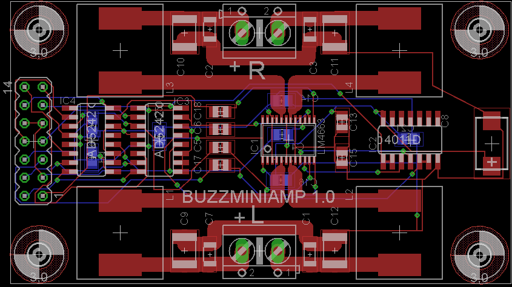

###SimpleAmp  

Small stereo amplifier PCB based on a TDA1519 IC. as two isolation transformers at the output as there were used in a system where noise was a constant issue. I don't know if that is an elegant solution but it was surely effective.

[Schematic](Images/SimpleAmp-01.sch.png)

###MiniAmp

Also, there is a board based on a LM4663 class-D amplifier chip and two AD5242 digital pots. This should have been the replacement for the older board, but unfortunately I did not get it to work in time. If anyone can have a look at it and tell me where I failed I'd be grateful :)

[Schematic](Images/MiniAmp-01.sch.png)

Made with CadSoft Eagle

###License

[BSD](LICENSE-BSD.txt) for software

[Creative Commons 4.0](LICENSE-CC.txt) for pcb and other artwork

###Copyright

Copyright (c) 2016 Bjoern Seip

